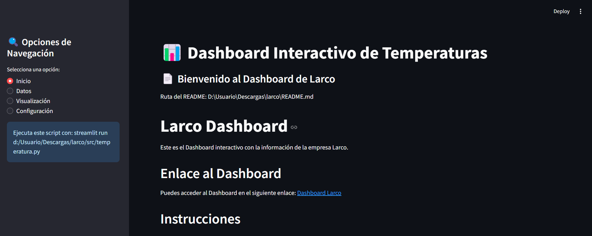
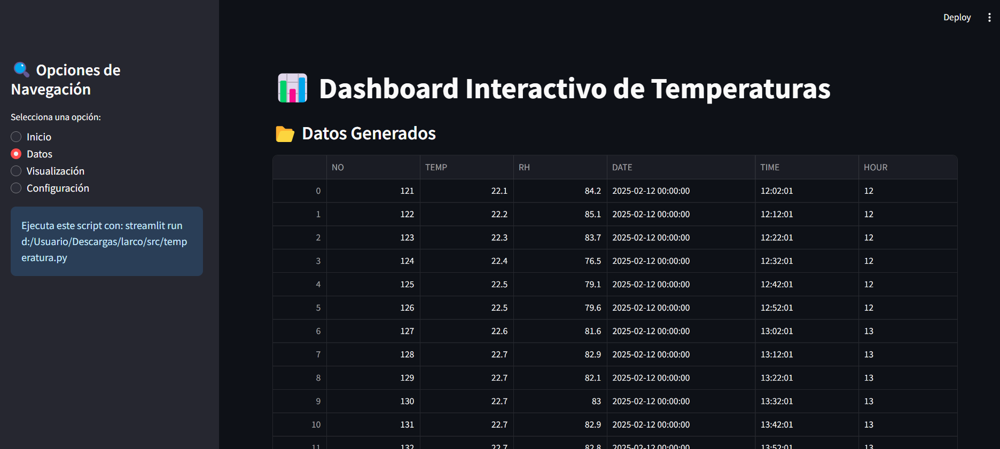
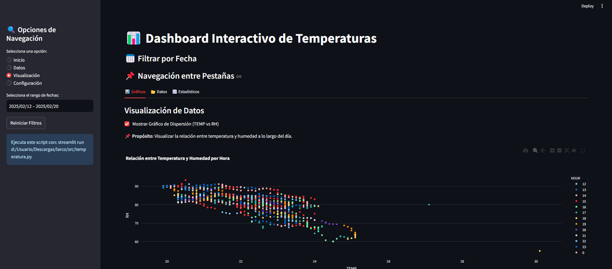

# Larco Dashboard

Este es el Dashboard interactivo con la información de la empresa Larco.

## Enlace al Dashboard

Puedes acceder al Dashboard en el siguiente enlace:
[Dashboard Larco](https://hotelnock.streamlit.app/)

## Instrucciones

1. **Navegación**:
   - En el menú lateral izquierdo encontrarás las opciones a usar, junto con un filtro por fechas.
   - El filtro de fechas se encuentra inicialmente con los valores máximo y mínimo del rango de fechas que están en el archivo.

2. **Opciones del Menú**:
   - **Inicio**: Página principal del Dashboard.
   - **Datos**: Muestra la información que está en el archivo Excel.
   - **Visualización**: Contiene tres pestañas:
     - **Gráficos**: Todos los gráficos útiles para el análisis.
     - **Datos**: Los datos utilizados para los gráficos.
     - **Estadísticos**: KPIs calculados de los datos utilizados.

## Descripción de las Pestañas

### Gráficos

En esta pestaña encontrarás diversos gráficos que te ayudarán a visualizar la información de manera clara y concisa.

### Datos

Aquí se muestran los datos crudos que se utilizan para generar los gráficos.

### Estadísticos

En esta sección se presentan los KPIs calculados a partir de los datos, proporcionando una visión general de las métricas clave.

## Capturas de Pantalla

## Contacto

Para más información, puedes contactarnos en [mzuluaga@larco.co](mailto:mzuluaga@larco.co).
